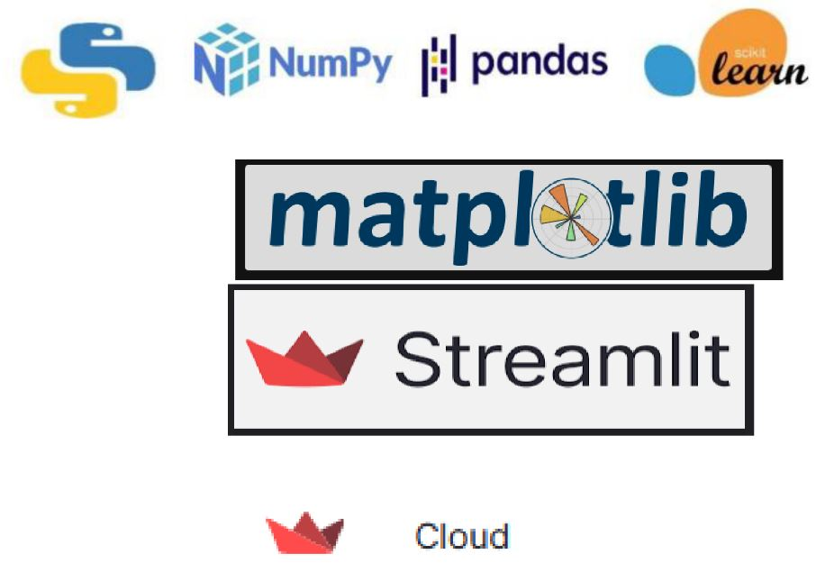

# Credit_Card_Default_Prediction

 
## Overview

This is an end-to-end Machine Learning project, which aims at develop a classification model for the problem of predicting credit card defaulters using a given labeled dataset.

The classifier used for this project is RandomForestClassifier.

Deployed in Streamlit Cloud.

Link to the application :
*****************************

## Dataset Information
This dataset contains information on default payments, demographic factors, credit data, history of payment, and bill statements of credit card holders
from Taiwan from April 2005 to September 2005.

Link : 
******************************
## Watch the Demo here

## Technologies Used

